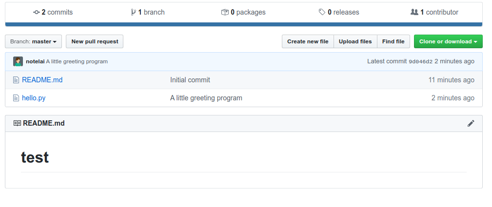
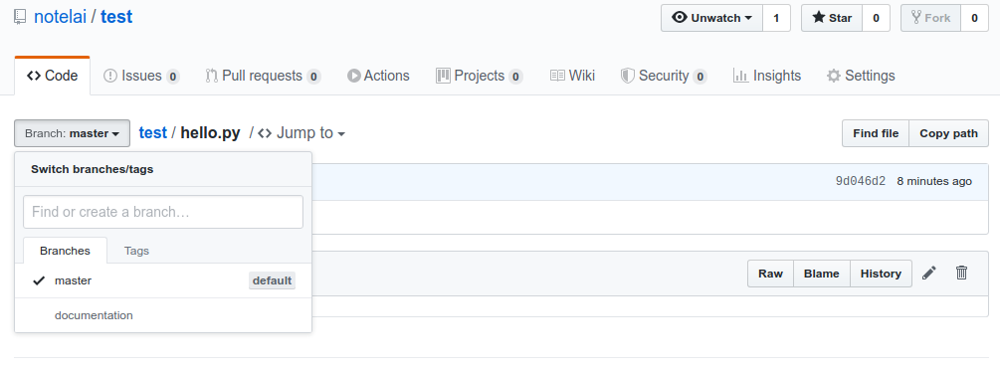

Using Git and Github for revision control
=========================================

What is Git?
------------

Git is a revision control system. It is designed to help you keep track
of collections of files which stem from a common source and undergo
modifications over time. The files tend to be human generated text. It
is very good at managing source code repositories, but it can also be
used to manage other things, such as configuration files and text
documents. It is not, however, a file backup system.

Git encourages a distributed style of project development. Each
contributor to a project has their own complete repository. Changes are
shared between repositories by *pushing* changes to, or *pulling*
changes from other repositories. Collaboration between developers is
greatly enhanced by websites such as [github](https://github.com/),
[bitbucket](https://bitbucket.org/)
and [gitorious](http://gitorious.org) which
provide convenient interfaces to managing multiple repositories.

There are many alternatives to git which each have their pros and cons.
Two of the more popular alternatives are:

- [Subversion](http://subversion.apache.org) is particularly suited to a centralised model of development.

- [Mercurial](http://mercurial.selenic.com) is very similar to Git, but is sometimes considered more user friendly.

Getting help
------------

There are lots of resources on the web for learning how to use Git. A
popular reference is *Pro Git*, which is freely available online
([http://git-scm.com/book](http://git-scm.com/book)). Another good
reference is the book *Version Control with Git*, by Loeliger and
McCullough.

## A simple workflow

### Step 1, create a github account.

Create a github account ([https://github.com/](https://github.com/)).
Do this step once only (unless you need multiple accounts).

You get unlimited numbers of (world readable) public repositories for
free.

Private repositories (that can be shared with selected users) cost money
(see [https://github.com/plans](https://github.com/plans)), but [discounts are available for academics](https://education.github.com/discount_requests/new).

### Step 2, sign into github and create a repository.

Sign in to your github account and create a new repository. Do this once
for every new project you have.


You will need to provide some information:

-   the repository name

-   a description of the repository

-   choose whether it is public (free) or private (costs money)

-   whether to initialise with a dummy README file (it is useful)

-   whether to provide an initial .gitignore file (probably leave this
    > out in the beginning)


### Step 3, clone your repository to your local computer.

Clone your new repository from github to your local computer.

Each repository on github is identified by a URL, which will look like
the one below:


Run the command below on your development machine in the directory where
you want to keep the repository (of course you should use the actual URL
of your own repository, not the one in the example).

```
$ git clone https://github.com/notelai/test.git
Cloning into 'test'...
remote: Counting objects: 3, done.
remote: Total 3 (delta 0), reused 0 (delta 0)
Unpacking objects: 100% (3/3), done.
```

This will create a directory with the same name as your repository (in this example it is called `test`).

If you change into that directory and list its contents you will see a
`.git` subdirectory, which is where Git keeps all the data for your
repository. You will also see working copies of the files in the
project. In this example the only such file is `README.md` which was
created automatically by github when the repository was first created.
(The .md extension on the file suggests that it uses the *Markdown*
syntax, see [https://help.github.com/articles/github-flavored-markdown](https://help.github.com/articles/github-flavored-markdown)).

```
$ cd test
$ ls -a
. .. .git README.md
$ ls .git
branches config description HEAD hooks index info logs objects packed-refs refs
```

### Step 4, commit a file to the repository.

Create a new file in the repository on your local computer and commit it
to your local repository.

How you create the file is immaterial. You could copy it from somewhere
else, create it in a text editor. In this case we’ll make a little
python program:

```
$ echo 'print("hello world")' > hello.py
```

Test that your new file is satisfactory, in this case we test our code:

```
$ python hello.py
hello world
```

Check the status of your repository:

```
$ git status
# On branch master
# Untracked files:
# (use "git add <file>..." to include in what will be committed)
#
# hello.py
nothing added to commit but untracked files present (use "git add" to track)
```

Notice that git tells you that the new file `hello.py` is not tracked
(not in the repository).

When you are happy with your file, you can stage it (this is not a
commit), but it will cause the file to be tracked:

```
$ git add hello.py
```

Note that git uses a two-stage process for committing changes. The first
stage is to "stage" your changes. Staged changes appear in the
repository index, but are not committed. You can stage many changes
together, and even amend or undo previously staged (but not committed)
changes. The second stage is to commit the current staged changes to the
repository. Committing causes the changes to be reflected in the state
of the repository.

Re-check the status of your repository:

```
$ git status
# On branch master
# Changes to be committed:
# (use "git reset HEAD <file>..." to unstage)
#
# new file: hello.py
#
```

Now we can see that the changes to `hello.py` have been staged and are
ready to be committed. Notice that `hello.py` is no longer untracked.

Commit your changes with a commit message:

```
$ git commit -m "A little greeting program"
[master b1cce11] A little greeting program
1 files changed, 1 insertions(+), 0 deletions(-)
create mode 100644 hello.py
```

Re-check the status of your repository:

```
$ git status
# On branch master
# Your branch is ahead of 'origin/master' by 1 commit.
#
nothing to commit (working directory clean)
```

Now we see that there a no uncommitted changes in the repository,
however git tells us that our local repository is one commit ahead of
the github version (which it calls `origin/master`).

### Step 5, push your changes to github.

Push the commit in your local repository to github (thus synchronising them).

```
$ git push origin
Username for 'https://github.com': <type your github username>
Password for 'https://<your github username>@github.com': 
Counting objects: 4, done.
Delta compression using up to 16 threads.
Compressing objects: 100% (2/2), done.
Writing objects: 100% (3/3), 305 bytes, done.
Total 3 (delta 0), reused 0 (delta 0)
To https://github.com/notelai/test.git
71a771a..b1cce11 master -> master
```

Now if you look at your repository on github you should see the file
`hello.py` has been uploaded, along with its commit time and commit
message.



You can inspect the contents of the file on github by clicking on its
name:


### Step 6, create a branch in your local repository.

You can ask git to tell you about the names of the current branches:

```
$ git branch
* master
```

By default your repository starts with a branch called master. The
asterisk next to the branch name tells you which is the current branch
(at the moment there is only one branch).

```
$ git branch documentation
$ git branch
documentation
* master
```

The first command above creates a new branch called `documentation`. The
second command shows us that the new branch has been created, but the
current branch is still `master`.

To switch to another branch you must check it out:

```
$ git checkout documentation
Switched to branch 'documentation'
$ git branch
* documentation
master
```

Let’s add a change to our existing `hello.py` file:

```
$ echo '#this is a comment' >> hello.py
```

Check the status of the repository (now in the documentation branch):

```
$ git status
# On branch documentation
# Changes not staged for commit:
# (use "git add <file>..." to update what will be committed)
# (use "git checkout -- <file>..." to discard changes in working
 directory)
#
# modified: hello.py
#
no changes added to commit (use "git add" and/or "git commit -a")
```

Stage the new changes and commit them, and check the status again:

```
$ git add hello.py 
$ git commit -m "Added a comment"
[documentation 9bbe430] Added a comment
1 files changed, 1 insertions(+), 0 deletions(-)
$ git status
# On branch documentation
nothing to commit (working directory clean)
```

Now we can push the new “documentation” branch to github:

```
$ git push origin documentation
Username for 'https://github.com': <your github username>
Password for 'https://<your github username>@github.com': 
Counting objects: 5, done.
Delta compression using up to 16 threads.
Compressing objects: 100% (2/2), done.
Writing objects: 100% (3/3), 314 bytes, done.
Total 3 (delta 0), reused 0 (delta 0)
To https://github.com/notelai/test.git
* [new branch] documentation -> documentation
```

On github you should be able to see the new branch:



### Step 7, merge the changes back into the master
branch.

To go back to the master branch you must check it out:

```
$ git checkout master
Switched to branch 'master'
```

You can confirm that the master branch does not yet have the changes
made in the documentation branch:

```
$ cat hello.py 
print("hello world")
```

Notice that the comment is missing.

You can pull the changes in the documentation branch back into the
master branch with the merge command:

```
$ git merge documentation
Updating b1cce11..9bbe430
Fast-forward
hello.py | 1 +
1 files changed, 1 insertions(+), 0 deletions(-)
```

In this case the merge was easy because there were no conflicts between
master and documentation. In this case git automatically updates the
tracked files in the current branch.

We can test that the changes have taken place by looking at the contents
of hello.py:

```
$ cat hello.py 
print("hello world")
#this is a comment
```

Check the status of the master branch:

```
$ git status
# On branch master
# Your branch is ahead of 'origin/master' by 1 commit.
#
nothing to commit (working directory clean)
```

Push the changes in the master branch back to github:

```
$ git push origin master
Username for 'https://github.com': notelai
Password for 'https://notelai@github.com': 
Total 0 (delta 0), reused 0 (delta 0)
To https://github.com/notelai/test.git
b1cce11..9bbe430 master -> master
```

Again you can verify on github that the changes have taken place.

To get an idea of the history of a project you can ask for a log of the
commit messages:

```
$ git log
commit 4049882fee41db390efc29d3f37075ca2a7fc7c1 (HEAD -> master, origin/master, origin/documentation, origin/HEAD, documentation)
Author: notelai <thien.nguyen@vnuk.edu.vn>
Date:   Wed May 20 09:31:25 2020 +0700
    Added a comment
commit 9d046d281b171a933d9556eeb6cbb27c89007b51
Author: notelai <thien.nguyen@vnuk.edu.vn>
Date:   Wed May 20 09:25:24 2020 +0700
    A little greeting program
commit 288ff2d3a78c4dac4787e8a1a8df043b9e9703cc
Author: Thien Nguyen <64153275+notelai@users.noreply.github.com>
Date:   Wed May 20 09:15:52 2020 +0700
```
